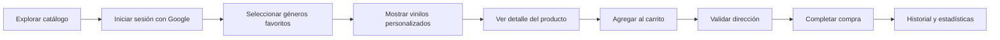

# Tienda de Vinilos

  
  
  
  

  Aplicación móvil nativa para Android enfocada en la compra de vinilos, desarrollada con Kotlin y Jetpack Compose, con backend propio en Laravel y MySQL.

  <a href="https://github.com/josueru444/TiendadeVinilos">Repositorio Android</a> ·
  <a href="https://github.com/josueru444/server-tienda-vinilos">Repositorio Backend</a>

  

## Descripción

Tienda de Vinilos es una app pensada para ofrecer una experiencia de compra personalizada. El usuario puede navegar por el catálogo sin iniciar sesión, pero para activar recomendaciones y guardar su información debe autenticarse con Google y configurar sus géneros musicales favoritos.

A partir de esas preferencias, la aplicación prioriza los vinilos relacionados con los gustos del usuario, permitiendo explorar productos, ver sus detalles, agregarlos al carrito y completar compras de forma más fluida.

## Vista General

## Funcionalidades principales

- Inicio de sesión y registro con Google.
- Configuración inicial de gustos musicales.
- Catálogo personalizado según géneros favoritos.
- Pantalla de detalle de producto con descripción completa.
- Carrito de compras.
- Validación de direcciones de envío antes de comprar.
- Historial de productos comprados.
- Gráfica con los géneros más comprados.
- Integración con backend propio en Laravel.

## Capturas

| Vista principal | Identidad visual |
| --- | --- |
|  |  |

## Tecnologías utilizadas

  
  
  
  
  

- Kotlin
- Jetpack Compose
- Android Studio
- Laravel
- MySQL

## Arquitectura

El proyecto está dividido en dos partes:

- **Frontend Android:** aplicación móvil desarrollada con Kotlin y Jetpack Compose.
- **Backend:** API construida con Laravel y MySQL para la lógica de negocio y persistencia.

## Flujo de uso

1. El usuario puede explorar el catálogo sin iniciar sesión.
2. Para una experiencia personalizada, inicia sesión con Google.
3. Si es su primera vez, selecciona sus géneros favoritos.
4. La app muestra primero los vinilos relacionados con esas preferencias.
5. El usuario puede revisar el detalle del producto.
6. Puede agregarlo al carrito o comprarlo directamente.
7. Antes de finalizar la compra, el sistema valida si tiene direcciones guardadas.
8. También puede consultar su historial y las estadísticas de compra.

## Mi aporte en el proyecto

- Diseñé las interfaces gráficas de la aplicación.
- Implementé las pantallas con Jetpack Compose y Kotlin.
- Desarrollé la API del sistema.
- Construí el backend en Laravel.
- Configuré la base de datos en MySQL.

## Retos y aprendizajes

El principal reto fue adaptarme a Jetpack Compose, ya que era mi primera vez trabajando con Kotlin. Aunque ya tenía experiencia en desarrollo móvil con XML y Java, este proyecto me obligó a aprender una forma distinta de construir interfaces y manejar el estado de la app.

También dediqué tiempo a investigar cómo simplificar las pantallas para que fueran más claras y fáciles de usar.

## Repositorios

- Frontend Android: https://github.com/josueru444/TiendadeVinilos
- Backend Laravel: https://github.com/josueru444/server-tienda-vinilos

## Estado actual

El proyecto nació como una entrega escolar, pero tanto la app móvil como el backend siguen siendo funcionales y están disponibles en sus respectivos repositorios.

## Instalación local

### Requisitos

- Android Studio instalado.
- Un emulador o dispositivo Android disponible.
- Acceso al backend Laravel y su base de datos MySQL.

### Pasos generales

1. Clona el repositorio del frontend Android.
2. Abre el proyecto en Android Studio.
3. Sincroniza Gradle y verifica que las dependencias estén instaladas.
4. Configura la URL de tu API para apuntar al backend correspondiente.
5. Ejecuta la app en un emulador o dispositivo físico.

## Contacto

Si quieres ver más proyectos o ponerte en contacto conmigo:

- GitHub: https://github.com/josueru444
- LinkedIn: https://www.linkedin.com/in/josue-ruiz-b01945196/
- Email: josueru444@gmail.com
